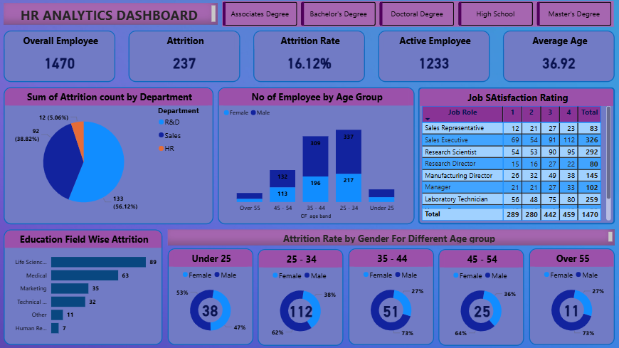

# HR Analytics Dashboard – Power BI Project

## Project Overview

The **HR Analytics Dashboard** is an interactive **Business Intelligence project built using Power BI** that helps organizations analyze employee data and understand workforce trends.

This dashboard provides insights into **employee attrition, department-wise attrition, job satisfaction, age distribution, and education field analysis**. It helps HR teams make **data-driven decisions to improve employee retention and workforce management**.

## Dashboard Preview

# Project Objectives

The main objectives of this project are:

* Analyze **employee attrition trends**
* Identify **departments with high attrition**
* Understand **employee age distribution**
* Evaluate **job satisfaction levels**
* Study **education field impact on attrition**
* Provide **HR insights for decision making**

# Dashboard Features

## 1️⃣ KPI Summary Cards

The dashboard provides key HR metrics at the top.

* **Overall Employees:** 1470
* **Attrition Count:** 237
* **Attrition Rate:** 16.12%
* **Active Employees:** 1233
* **Average Age:** 36.92

These KPIs give a quick overview of workforce status.

## 2️⃣ Attrition by Department

This pie chart shows **which departments have the highest attrition**.

Departments included:

* Research & Development
* Sales
* Human Resources

This helps HR identify departments where employee turnover is high.

## 3️⃣ Employee Distribution by Age Group

This bar chart shows **number of employees in different age groups**.

Age Groups:

* Under 25
* 25 – 34
* 35 – 44
* 45 – 54
* Over 55

It also compares **male vs female employee distribution**.

## 4️⃣ Job Satisfaction Rating Table

This table displays job satisfaction ratings for different job roles.

Ratings range from **1 to 4**.

Job roles included:

* Sales Representative
* Sales Executive
* Research Scientist
* Research Director
* Manufacturing Director
* Manager
* Laboratory Technician

This helps identify which roles have **higher or lower satisfaction levels**.

## 5️⃣ Education Field Wise Attrition

This bar chart shows attrition based on employee education fields.

Education fields include:

* Life Sciences
* Medical
* Marketing
* Technical Degree
* Human Resources
* Other

This helps analyze whether certain education backgrounds experience more attrition.

## 6️⃣ Attrition Rate by Gender & Age Group

This section shows attrition distribution across **gender and different age groups**.

Age Groups:

* Under 25
* 25 – 34
* 35 – 44
* 45 – 54
* Over 55

It helps HR understand **which age groups and genders are more likely to leave the company**.

# Tools & Technologies Used

| Tool                    | Purpose                                   |
| ----------------------- | ----------------------------------------- |
| **Power BI**            | Data visualization and dashboard creation |
| **Power Query**         | Data cleaning and transformation          |
| **DAX**                 | Calculations and measures                 |
| **Excel** | Data source                               |

# Key Insights from Dashboard

Some important insights from this analysis:

* **Attrition Rate:** 16.12% of employees left the company.
* **Sales Department** shows significant attrition.
* Most employees belong to the **25 – 34 age group**.
* **Life Sciences** education field has the highest attrition.
* Certain job roles show **lower satisfaction ratings**, which may lead to attrition.

# Business Use Cases

This dashboard can help organizations:

* Improve **employee retention strategies**
* Identify **high attrition departments**
* Monitor **employee satisfaction**
* Analyze workforce **demographics**
* Support **HR decision making**
